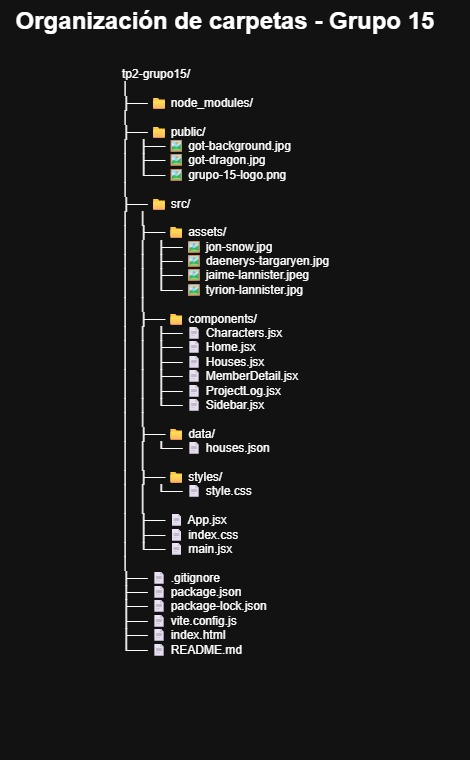

# 🐉 Game of Thrones - Presentación Grupo 15

## 📖 Descripción del Proyecto

Este proyecto es la evolución del TP1, migrando el sitio estático a una SPA (Single Page Application) dinámica desarrollada con React para la materia Desarrollo Front End - 2A.

La página, ambientada en Game of Thrones, utiliza React Router DOM para la navegación, consume un JSON local (para la sección "Casas") y una API pública (para "Personajes"). El objetivo es demostrar habilidades en componentización, manejo de estados, hooks, routing y consumo de APIs.

El objetivo es demostrar habilidades en:

- Migración de un sitio estático a una SPA (Single Page Application) con React
- Implementación de rutas y navegación client-side (React Router DOM).
- Manejo de estado (Hooks useState) y ciclo de vida (Hooks useEffect).
- Consumo de datos JSON locales y APIs públicas (fetch asíncrono).

---

## 🛠️ Tecnologías Utilizadas

- **React**
- **Vite** (Como bundler y servidor de desarrollo)
- **React Router DOM** (Para la navegación SPA)
- **Google Fonts** (Montserrat-Roboto)
- **Vercel** (Para despliegue)

---

## ⚙️ Funcionalidades principales

- **Navegación SPA**: Uso de react-router-dom para navegar entre secciones sin recargar la página.
- **Componentización**: El layout se divide en componentes reutilizables.
- **Datos locales (JSON)**: La sección "Casas" renderiza datos dinámicamente desde un archivo houses.json local.
- **Consumo de API (Fetch)**: La sección "Personajes" consume la API thronesapi.com de forma asíncrona.
- **Manejo de estados**: Se utiliza useState para manejar el estado de la API y del menú hamburguesa.
- **Diseño responsive**: Implementación de un menú hamburguesa "off-canvas" para móviles (<= 900px).

## 🏛️ Arquitectura del proyecto (requisito 7)

### 1. Estructura de Carpetas del Proyecto

Este diagrama muestra la organización completa de archivos y carpetas de nuestra aplicación React:

**Descripción:**

- **Raíz del proyecto**: Contiene archivos de configuración como `package.json`, `vite.config.js`, y el punto de entrada `index.html`
- **Carpeta `public/`**: Recursos estáticos como imágenes de fondo, logos y diagramas
- **Carpeta `src/`**: Código fuente de la aplicación
  - **`assets/`**: Imágenes de los miembros del equipo y personajes
  - **`components/`**: Componentes React reutilizables
  - **`data/`**: Archivo JSON local con información de las casas
  - **`styles/`**: Archivos CSS para estilos

### 2. Árbol de Componentes React

Este diagrama ilustra la jerarquía de componentes y su relación de renderizado:

**Descripción:**

- **`App`**: Componente principal que contiene toda la aplicación
- **`Sidebar`**: Menú de navegación lateral
- **`Routes`**: Sistema de enrutamiento que maneja las diferentes vistas
- **Vistas principales**: 
  - **`Home`**: Página de inicio con información del equipo
  - **`ProjectLog`**: Bitácora del proyecto con detalles de miembros
  - **`Characters`**: Lista de personajes consumidos desde API externa
  - **`Houses`**: Información de casas desde JSON local
- **Flujo de datos**: Muestra cómo se renderizan componentes hijos y se consumen datos tanto locales como de APIs externas

## 🚀 Cómo correr el proyecto localmente

1- Clonar el repositorio:

  git clone [(https://github.com/martincaceres2/tp2-react-grupo15)]

2- Instalar dependencias:

  npm install

3- Correr el servidor de desarrollo:

  npm run dev

---

## 👥 Integrantes del Grupo 15

- Martin Caceres - Integrante 1 (Jon Snow)
- Rocio  Pesqueira - Integrante 2 (Daenerys Targaryen)
- Gerardo Fabián Quispe - Integrante 3 (Jaime Lannister)
- Nicolás Francisco	Garay Lucena - Integrante 4 (Tyrion Lannister)

---

**Desarrollado por el Grupo 15 - 2025**
